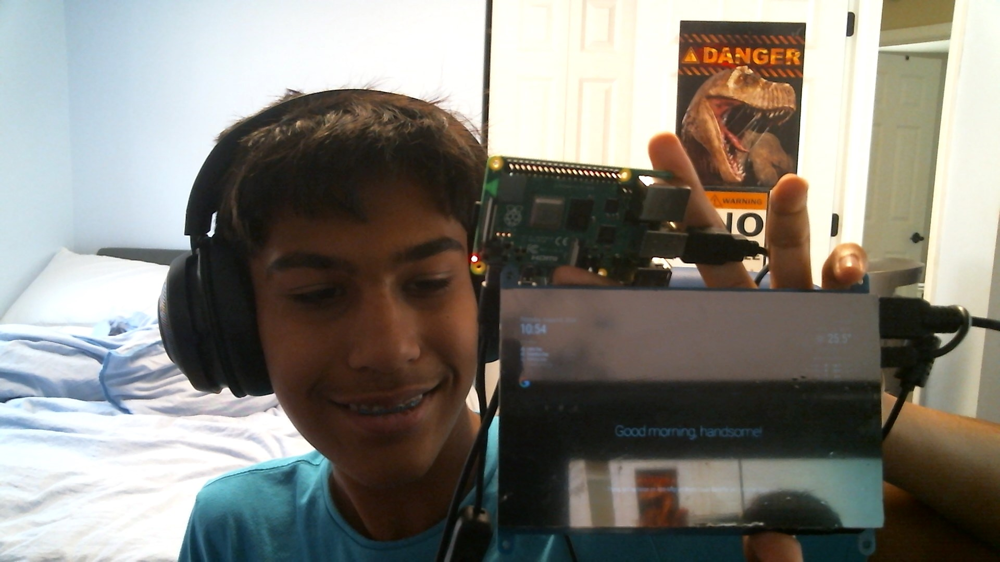

# Bluestamp Magic Mirror
A smart mirror is an innovative device that integrates a reflective surface with a digital display, providing real-time information such as weather updates, and news. I think that the hardest part of making of this was getting the VNC connected because I had to install so many different apps.

| **Engineer** | **School** | **Area of Interest** | **Grade** |
|:--:|:--:|:--:|:--:|
| Vivan B | Prospect Highschool | Aeronautical Engineering | Incoming Freshman



# Second Milestone

<iframe width="560" height="315" src="https://www.youtube.com/embed/ORGMPVJyOLk?si=q19fnz-xWn8Wa-4r" title="YouTube video player" frameborder="0" allow="accelerometer; autoplay; clipboard-write; encrypted-media; gyroscope; picture-in-picture; web-share" allowfullscreen></iframe>

- I have got the google assistant working and spotify working this is basically what i will stick with this for now
- I was very surpised at how much harder getting the modules to work was than just the baseline
- I installed a bad module and it made my mirror not work so i had to delete the MagicMirror software and reinstall it, there were also multiple times when installing google assistant where i did not know what to do so i had to spend 10 to 15 minutes just to find a button.
- i just need to get the frame and the mirror film on the display to make it a mirror and then ill be done

  The Code in the config.js file i used is right here
  
```
 /* Config Sample
 *
 * For more information on how you can configure this file
 * see https://docs.magicmirror.builders/configuration/introduction.html
 * and https://docs.magicmirror.builders/modules/configuration.html
 *
 * You can use environment variables using a `config.js.template` file instead of `config.js`
 * which will be converted to `config.js` while starting. For more information
 * see https://docs.magicmirror.builders/configuration/introduction.html#enviromnent-variables
 */
let config = {
	address: "localhost",	// Address to listen on, can be:
							// - "localhost", "127.0.0.1", "::1" to listen on loopback interface
							// - another specific IPv4/6 to listen on a specific interface
							// - "0.0.0.0", "::" to listen on any interface
							// Default, when address config is left out or empty, is "localhost"
	port: 8080,
	basePath: "/",	// The URL path where MagicMirror² is hosted. If you are using a Reverse proxy
									// you must set the sub path here. basePath must end with a /
	ipWhitelist: ["127.0.0.1", "::ffff:127.0.0.1", "::1"],	// Set [] to allow all IP addresses
									// or add a specific IPv4 of 192.168.1.5 :
									// ["127.0.0.1", "::ffff:127.0.0.1", "::1", "::ffff:192.168.1.5"],
									// or IPv4 range of 192.168.3.0 --> 192.168.3.15 use CIDR format :
									// ["127.0.0.1", "::ffff:127.0.0.1", "::1", "::ffff:192.168.3.0/28"],

	useHttps: false,			// Support HTTPS or not, default "false" will use HTTP
	httpsPrivateKey: "",	// HTTPS private key path, only require when useHttps is true
	httpsCertificate: "",	// HTTPS Certificate path, only require when useHttps is true

	language: "en",
	locale: "en-US",
	logLevel: ["INFO", "LOG", "WARN", "ERROR"], // Add "DEBUG" for even more logging
	timeFormat: 24,
	units: "metric",

	modules: [
		{
			module: "alert",
		},
		{
			module: "updatenotification",
			position: "top_bar"
		},
		{
			module: "clock",
			position: "top_left"
		},
		{
			module: "calendar",
			header: "US Holidays",
			position: "top_left",
			config: {
				calendars: [
					{
						fetchInterval: 7 * 24 * 60 * 60 * 1000,
						symbol: "calendar-check",
						url: "https://ics.calendarlabs.com/76/mm3137/US_Holidays.ics"
					}
				]
			}
		},
		{
			module: "compliments",
			position: "lower_third"
		},
		{
			module: "weather",
			position: "top_right",
			config: {
				weatherProvider: "openmeteo",
				type: "current",
				lat: 42.082981,
				lon: -87.980461
			}
		},
		{
			module: "weather",
			position: "top_right",
			header: "Weather Forecast",
			config: {
				weatherProvider: "openmeteo",
				type: "forecast",
				lat: 42.082981,
				lon: -87.980461
			}
		},
		{
			module: "newsfeed",
			position: "bottom_bar",
			config: {
				feeds: [
					{
						title: "New York Times",
						url: "https://rss.nytimes.com/services/xml/rss/nyt/HomePage.xml"
					}
				],
				showSourceTitle: true,
				showPublishDate: true,
				broadcastNewsFeeds: true,
				broadcastNewsUpdates: true
			 }
		},              
		{          
		         module: "MMM-GoogleAssistant",
		         configDeepMerge: true,
		         lang: "en-Us",
		         config: {
		           assistantConfig: {
		             latitude: 42.082981,
		             longitude: -87.980461,
			   },
			   recipes: [
			     "../../EXT-Spotify/recipe/EXT-Spotify.js",
			   ],
			 }
		},        
		{         
			   module: "EXT-Detector",
			   position: "top_left",
			   configDeepMerge: true
		},  	    
		{	    
		 	   module: 'EXT-Spotify',
		 	   position: 'top_left',
		 	   config: {
		 	     updateInterval: 1000,
		 	     idleInterval: 10000,
		 	     useBottomBar: false,
		 	     CLIENT_ID: "9bb1ae21a2804d2ca10c5d2efd8af7d6",
		 	     CLIENT_SECRET: "37c20a9c65324cb5bd5aa73752827f41",
		 	     mini: true,
		 	     forceSCL: false,
		 	     noCanvas: false
		 	 }
		},
	]
};

/*************** DO NOT EDIT THE LINE BELOW ***************/
if (typeof module !== "undefined") { module.exports = config; }
```
# First Milestone

<iframe width="560" height="315" src="https://www.youtube.com/embed/96U5nTjL_Ug?si=n02NEri9h8aJAPGn" title="YouTube video player" frameborder="0" allow="accelerometer; autoplay; clipboard-write; encrypted-media; gyroscope; picture-in-picture; web-share" allowfullscreen></iframe>

I used two components in my first milestone a Raspberry Pi and an lcd display to code the Raspberry Pi I had to install the thirty-two-bit Raspberry Pi os onto a micro sd card now that I had everything installed I could run a few commands the first one I ran was:
```
git clone https://github.com/MichMich/MagicMirror
```
this command gets the file information from github, then I ran:
```
cd MagicMirror/
```
this command compiles all the information from the first command into a file with that name, after that we need to install all of the information using the command below:
```
npm run install-mm
```
After this, you have all this data on your Rasberry Pi you have to get it from the configuration file which contains all Magic Mirrors software code. That is done by entering:
```
cp config/config.js.sample config/config.js
```
now we need to tell the computer to use all the information and do something with it in this case we are telling it to open up the magic mirror software by running the code:
```
npm run start
```
now the magic mirror software boots up now because it is just the baseline it only shows the date, time, weather, and news. I hope to add more modules like a google assistant and spotify:

# Bill of Materials

| **Part** | **Note** | **Price** | **Link** |
|:--:|:--:|:--:|:--:|
| Raspberry Pi | Programming the mirror | $95.19 | <a href=" https://www.amazon.com/RasTech-Raspberry-Starter-Heatsink-Screwdriver/dp/B0C8LV6VNZ/ref=sr_1_4?crid=3506HY00MCGVM&dib=eyJ2IjoiMSJ9._zkM62vSQ8p7tNr88715LdMv_qHh72Je-tkF9PXEa3chDE53QT4aZu4AGAb4ihE61QY4ZD55nKF6Fp2Kfs8t7AbafM_JrlJFfHo9OB4eAVGqa0EB-7aoBQHPmhKHZ2MW8ny-Kd44bMVlVxPlTWVk5YHIN5P3uKVqrE5Dcal0rKkHny-O6Xyb5ux2AOU6OwVbkag_bqBX66RQNRrgBuz-0pS43mcx93IZTQA9R8NaJJypYU2HAycp-XicTFmyU60a01Nfm9iuyo6B9yA8ppN3OQQyJ-NQ9xyNPxfTLwkqtng.yAYpU6outhQcZmOZhN9Wb6yTw7A85CNUbXZguGInZNg&dib_tag=se&keywords=raspberry%2Bpi%2Bkit&qid=1718848547&s=electronics&sprefix=rasbperry%2Bpi%2Bkit%2Celectronics%2C83&sr=1-4&th=1"> Link </a> |
| LCD Display | showing the information that we want it to | $41.35 | <a href=" https://www.amazon.com/Hosyond-Display-1024×600-Capacitive-Raspberry/dp/B09XKC53NH/ref=sr_1_3?crid=1KKB9WC62OIAD&keywords=raspberry%2Bpi%2Bips&qid=1685911698&s=electronics&sprefix=raspberry%2Bpi%2Bips%2B%2Celectronics%2C87&sr=1-3&th=1#customerReviews"> Link </a> |
| Keyboard and mouse | If you want to type on the display without connecting it to the computer again | $19.99 | <a href=" https://www.amazon.com/gp/product/B07XDWCLYF/ref=ppx_yo_dt_b_search_asin_title?ie=UTF8&psc=1"> Link </a> |
